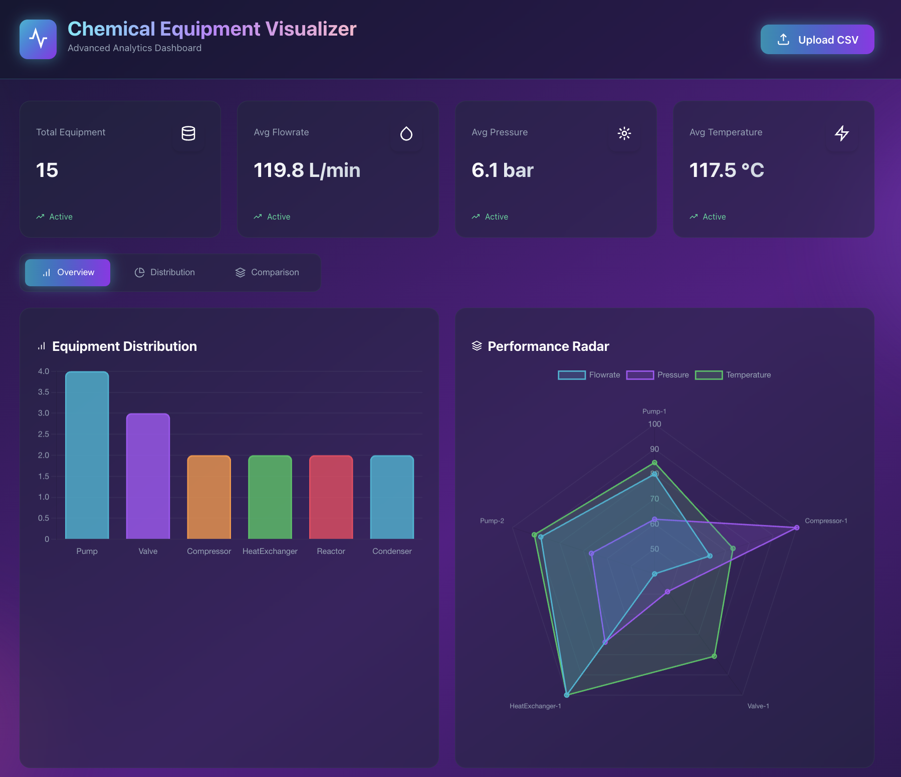
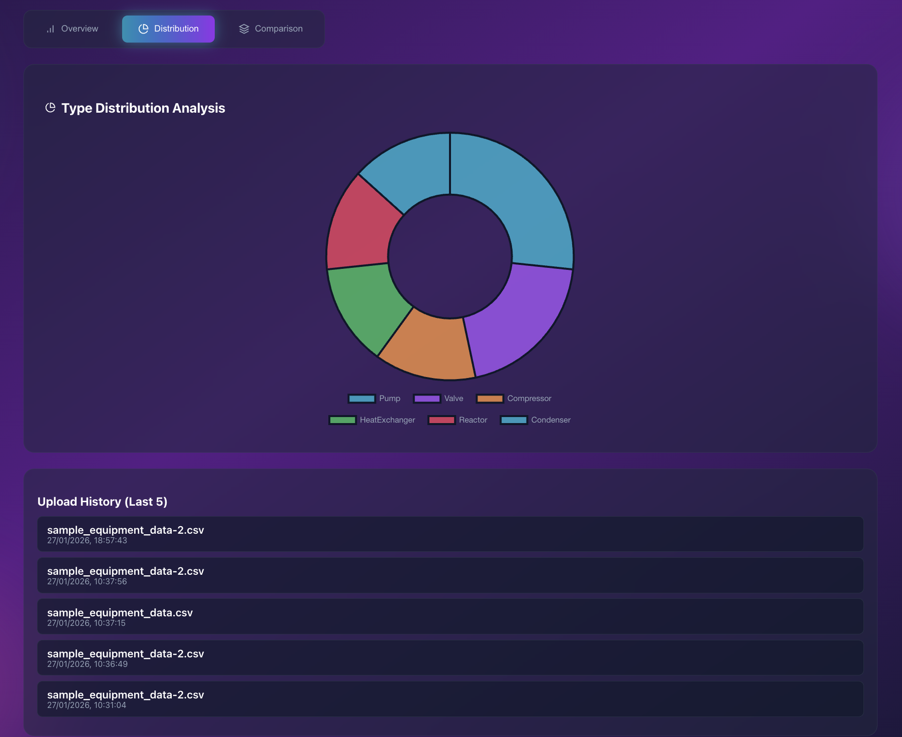
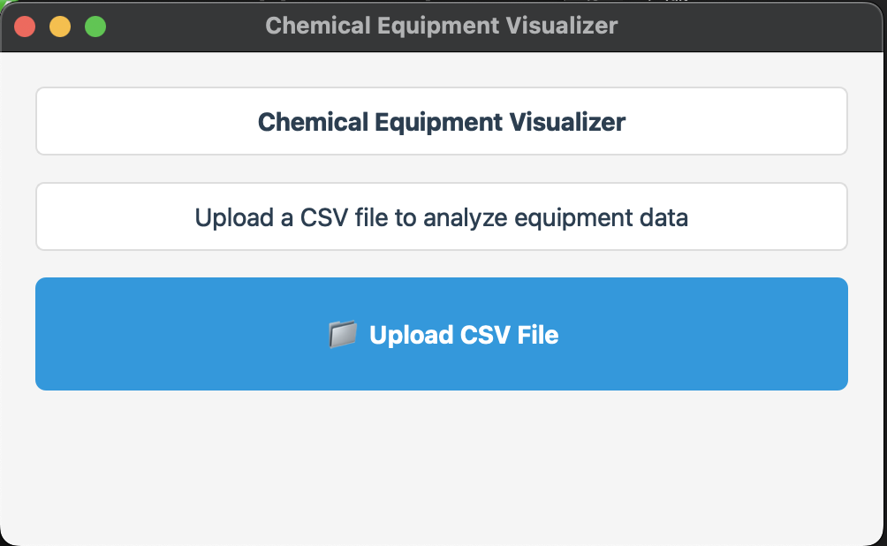
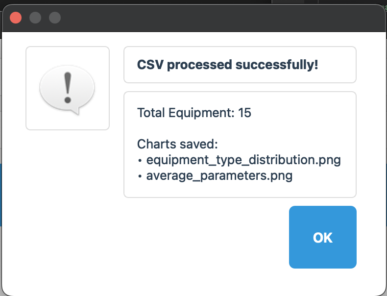
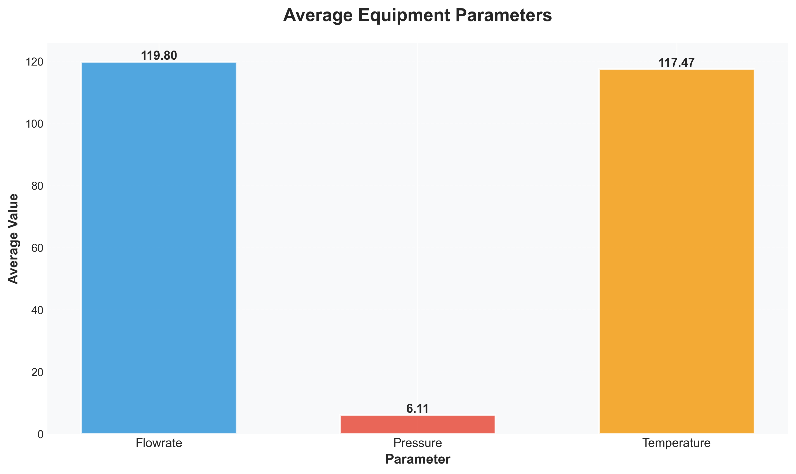
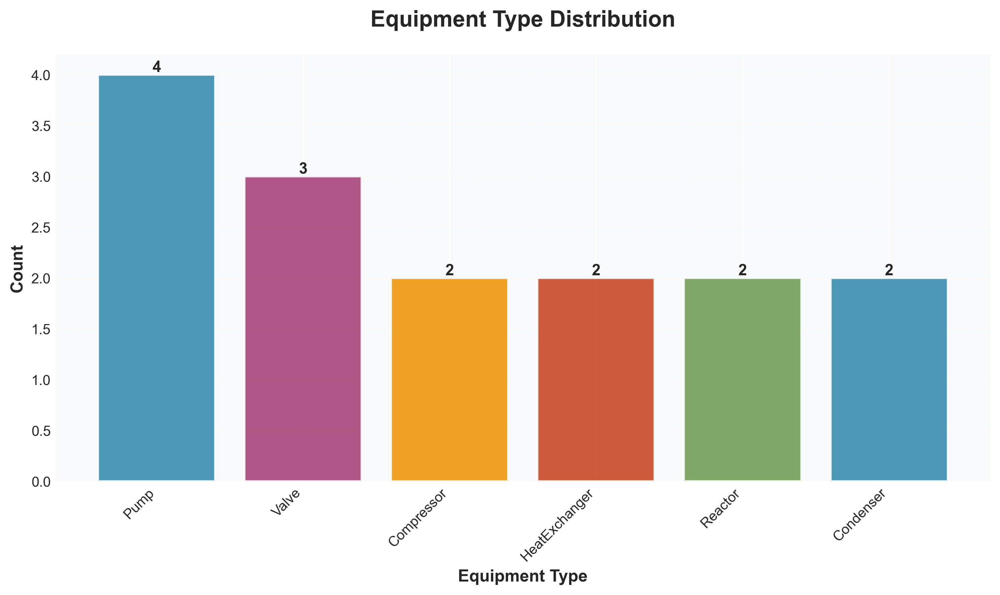

# Chemical Equipment Parameter Visualizer
Hybrid Web + Desktop Application

## Project Overview
The Chemical Equipment Parameter Visualizer is a hybrid application that works as both a Web Application and a Desktop Application. It allows users to upload a CSV file containing chemical equipment parameters, performs basic data analysis, and visualizes the results using tables and charts.

## Dataset Format
The uploaded CSV file must contain the following column names exactly:

Equipment Name,Type,Flowrate,Pressure,Temperature

Example:
Heat Exchanger,Exchanger,120,5.5,350  
Pump A,Pump,80,3.2,90  
Reactor R1,Reactor,60,7.1,500  

## 📸 Screenshots

### Web Dashboard

### Analytics Charts

### Desktop Application (PyQt5)

### Desktop Report

|  |  |

## Project Structure
chemical-equipment-visualizer/
├── backend/
│   ├── server/
│   │   ├── equipment/        # Django app (models, views, utils)
│   │   ├── server/           # Django project settings
│   │   ├── reports/          # Generated PDF reports
│   │   ├── db.sqlite3
│   │   └── manage.py
│   └── venv/
│
├── desktop_reports/
│   └── charts/               # Generated charts
│
├── web-frontend/
│   └── web/                  # React frontend
│
├── desktop_app.py            # PyQt5 desktop application
├── README.md
└── .git

## Setup Instructions

### 1. Clone the Repository
git clone https://github.com/19-aadya/chemical-equipment-visualizer
cd chemical-equipment-visualizer

### 2. Backend Setup (Django)
python -m venv venv
source venv/bin/activate   # Windows: venv\Scripts\activate
pip install -r requirements.tx
python manage.py migrate
python manage.py runserver

Backend runs at:
http://127.0.0.1:8000/

### 3. Desktop Application (PyQt5)
cd desktop_app
python visualizer.py

### 4. Web Application (React)
cd frontend
npm install
npm start

Web app runs at:
http://localhost:3000/

## Features
- CSV file upload
- Data validation
- Summary statistics
- Graphical data visualization
- Hybrid Web + Desktop support
- PDF report generation

## Future Enhancements
- User authentication
- Dataset history management
- PDF report generation
- Advanced analytics
